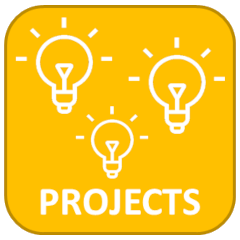

## Welcome!

{: .center-image }

The Open Source Hydro (OSHydro) is an initiative foster collaboration and open source software development 
within the hydrographic surveying and ocean mapping community.

***

### Rationale

Several challenges are being faced by the hydrographic community:

* Reproducibility: a fragmentation of software tools that act like black boxes making most products effectively unreproducible.
* Big Data: survey datasets are quickly growing in size and traditional software tools can’t handle them. 
* Artificial Intelligence: a growing gap between the technological sophistication of industry solutions (high) and open-source solutions (low).

OSHydro aims to mitigate these challenges providing an open and collaborative environment.

***

### Mission Statement

Our mission is to facilitate the creation of an ecosystem of open hydrographic algorithms and tools that 
the next generation of hydrographers and ocean mappers can benefit from. 
These solutions must be scalable in order to meet the current and future challenges of big data, and 
they should follow the cutting edge of research development.

***

### Get Involved

The OSHydro initiative is completely open to involvement from anyone with interest. For more information, contact the [facilitators](#initiative-facilitators).

This [page](projects.md) provides links and information about relevant projects. Feel free to edit the page on [GitHub](https://github.com/OSHydro/OSHydro.github.io/blob/master/projects.md) adding your projects.

[{: .center-image }](projects.html)

For discussions and announcements related to the OSHydro initiative, join the [Google Group](https://groups.google.com/forum/#!forum/oshydro).

***

### Initiative Facilitators

* [Damian Manda (NOAA Office of Coast Survey)](mailto:damian.manda@noaa.gov)
* [Giuseppe Masetti (Danish Geodata Agency)](mailto:gimas@gst.dk)
* [Jose Cordero (Instituto Hidrográfico de la Marina)](mailto:jcorros@fn.mde.es)
* [Christos Kastrisios (UNH Center for Coastal and Ocean Mapping)](mailto:christos.kastrisios@unh.edu)
  

***