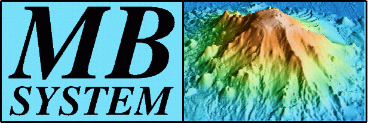

## MBsystem, the free, open-source sonar data editing software

{: .center-image }

MB-System is an open source software consisting of a set of programs to manipulate, process, list, or display bathymetry and backscatter imagery data derived from multibeam, interferometry, and sidescan sonars. 

The core of MB-System is the input/output library (MBIO). This library allows programs to work transparently with a number of multibeam sonar formats.This approach has allowed the creation of "generic" utilities which can be applied in a uniform manner to sonar data from a variety of sources. Most of the programs are command-line tools, but the package does include graphical tools for editing swath bathymetry, editing navigation, modeling bathymetry calculation, and adjusting survey navigation.

MB-System was originally developed at the Lamont-Doherty Earth Observatory of Columbia University (L-DEO) and is now a collaborative effort between the Monterey Bay Aquarium Research Institute (MBARI) , the University of New Hampshire, and the Cen­ter for Mar­ine En­vir­on­mental Sci­ences at the University of Bremem (MARUM). The National Science Foundation has supported MB-System development since 1993. The Packard Foundation has provided the primary support for MB-System through MBARI since 1998.

MB-System is MB-System is written in the C and C++ programming languages, and is delivered in packaged distributions for Linux and MacOS, as well as in the form of Docker containers. All those packages and the source code is freely available for download.

MBsystem is widely used by research institutions in deep water mapping from surface vessels and unmanned underwater vehicles. 

More information and download links [here](https://github.com/dwcaress/MB-System) 

***

